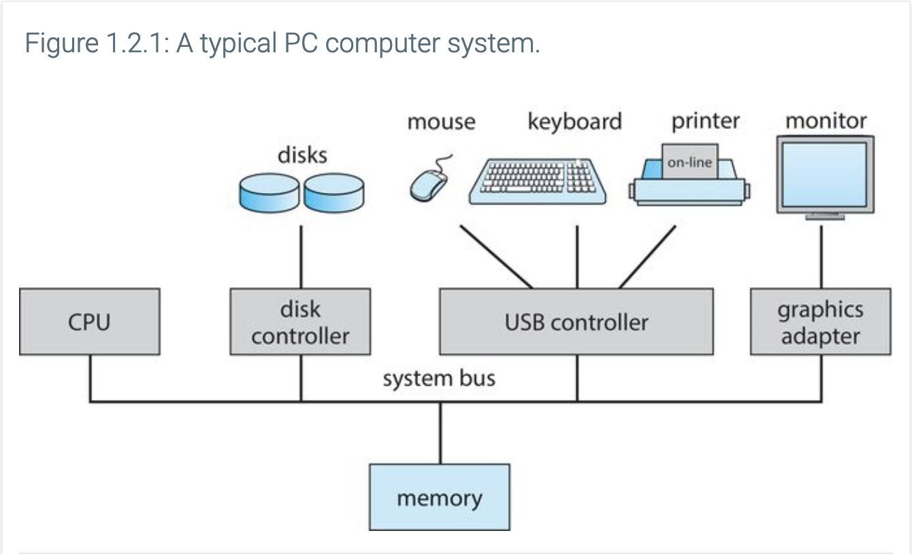
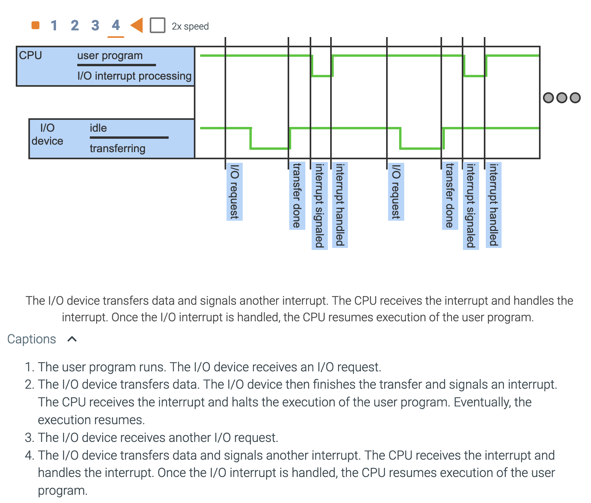
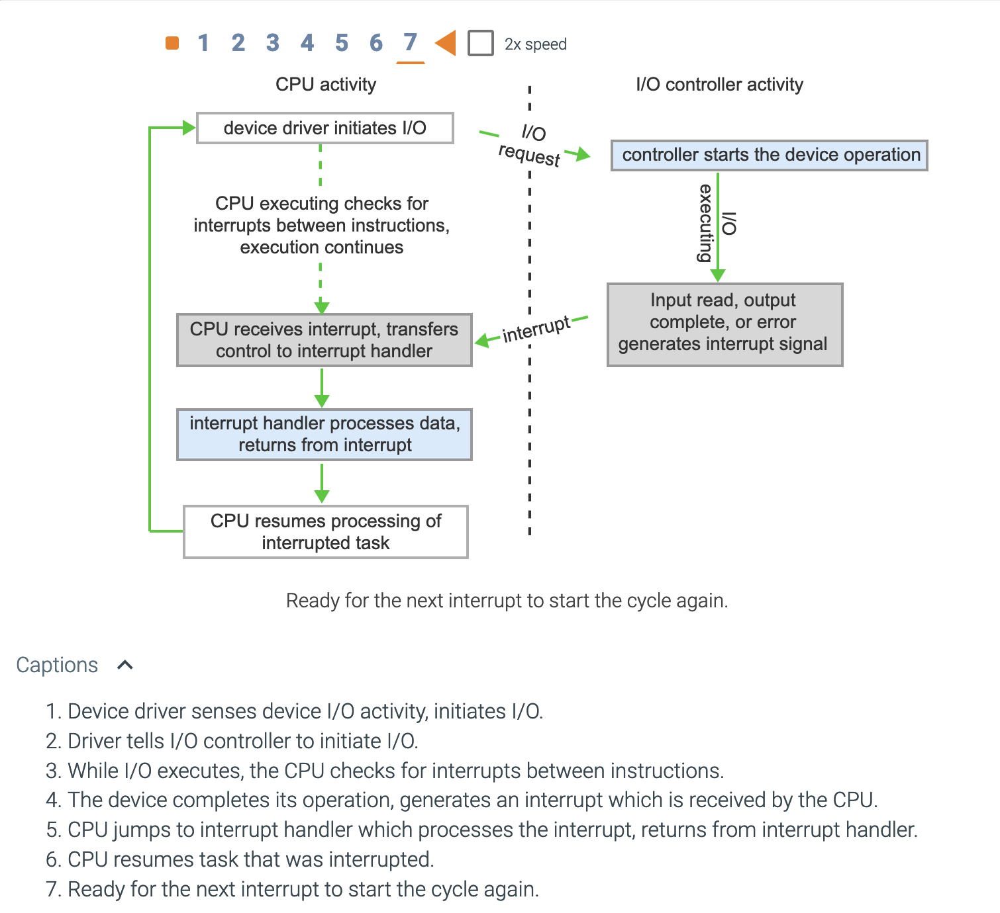

# Chapter 1: Introduction

## Objectives of this chapter
- How is a computer system organized?
- What is the point of interrupts?
- What components is a modern multiprocessor computer system composed of?
- What is user mode?
- What is kernel mode?
- Can you illustrate the transition between user mode and kernel mode?
- How are operating systems used in different computing environments?
- Can you name examples of free and open source operating systems?

## Chapter 1.1: What operating systems do

- An operating system is software that manages a computer's hardware

- Computer systems are divided into 4 components:
    - Hardware
    - Application programs
    - Operating system
    - A user

- A computer's hardware provides resources that the operating system will manage

- A computer's hardware is made out of:
    - Memory
    - CPU (Central processing Unit)
    - I/O (Input/Output) devices

- Application programs are software that require resources from the computer's hardware to carry out their duty

The book's definition of what an OS is

    
 An OS is composed of:

        <ul>
            <li>A kernel that is loaded at boot time (when the computer turns on)</li>
            <li>Device drivers and kernel functions that are loaded at runtime</li>
            <li>System programs related to the kernel</li>
        </ul>

- Middleware is software that provides additional services to application developers

## Chapter 1.2: Computer system organization

- A computer's system is composed of:
    - One or many CPUs
    - One or more devices connected to the computer
    - A device controller for each device connected to the computer
    - A device driver for each device controller connected to the computer
    - A system bus that connects all the CPUs and all device CONTROLLERS to memory

- A system bus is the main communications path between major computer components

### Interrupts

#### Overview

Interrupts are signals that stop the CPU from whatever it is currently doing, and tell it to change its focus to the event that trigerred the interrupt.

When you plug in your keyboard to start typing away, this happens:
1. The device driver loads the appropriate registers in the device controller
2. The device controller looks at the registers to determine what to do (i.e.: read from keyboard)
3. The device controller transfers data from the device to its local buffer (memory)
4. When the data has finished transferring, the device controller tells the device driver that the operation is finished
5. The device driver gives control back to the other parts of the operating system

As you can see in the picture above, whenever the I/O device is ***in the process of transferring data***, nothing happens to the CPU.

It is only ***after the I/O device is done transferring data*** that the interrupt signal is sent to the CPU, stopping it from whatever it was doing, and forcing it to handle it.

The CPU only returns back to its previous process ***after*** handling the interrupt

An ***interrupt vector*** is a table of pointers to interrupt service routines, so the CPU has an easier and faster time figuring out where to go to handle each interrupt

Interrupt vectors must save the state of whatever was interrupted

#### Implementation

The interrupt mechanism is implemented through:

- A wire called ***the interrupt-request line***
- A [BLANK] called the ***interrupt handler*** that handles the interrupt and returns the "wheel" to the CPU

Life cycle of an interrupt is as follows:
1. Device controller ***raises*** an interrupt
2. CPU ***catches*** the interrupt
3. CPU ***dispatches*** the interrupt to the ***interrupt handler***
4. Interrupt handler ***clears*** the interrupt by servicing the device

#### New problems

What if the interrupt 
