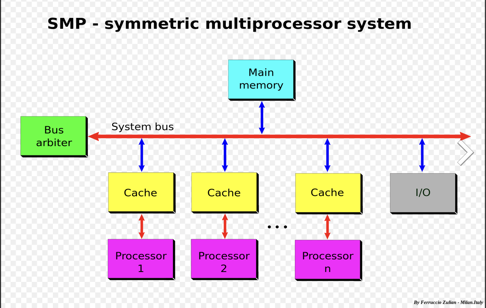
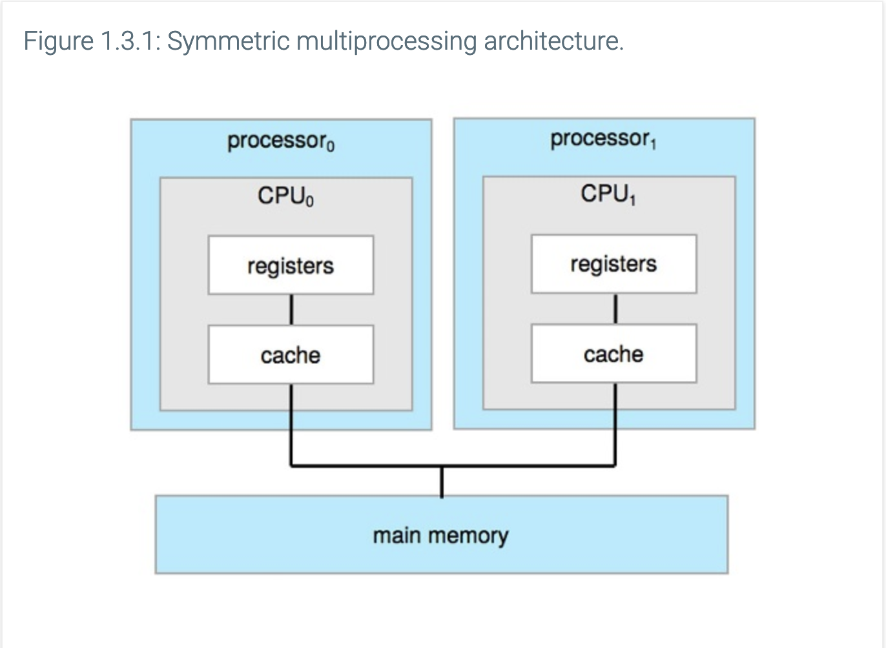
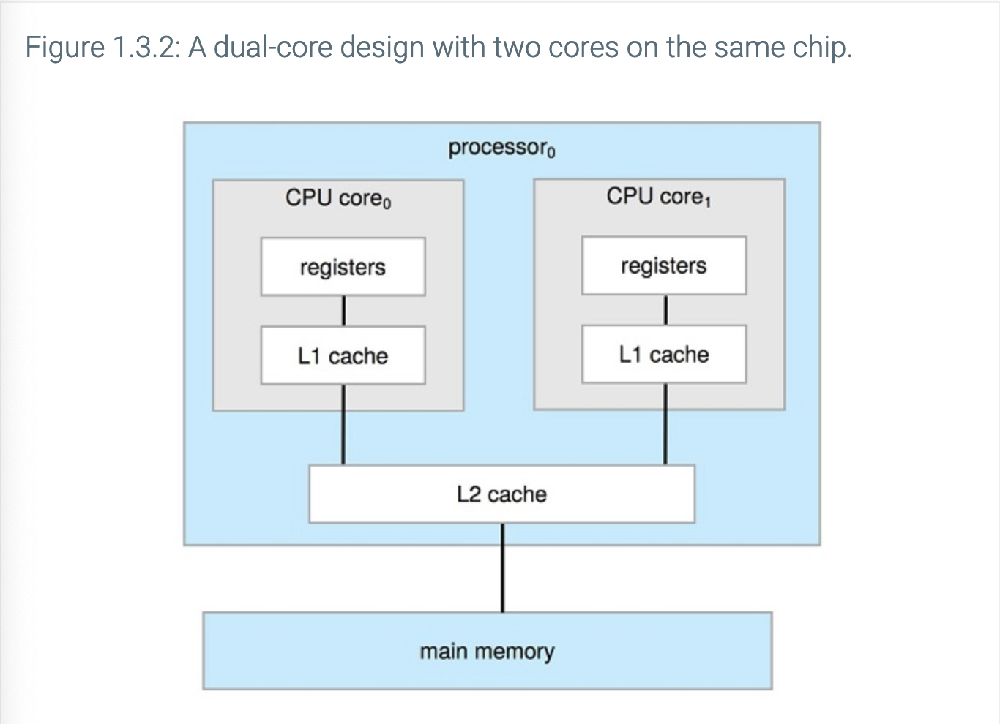
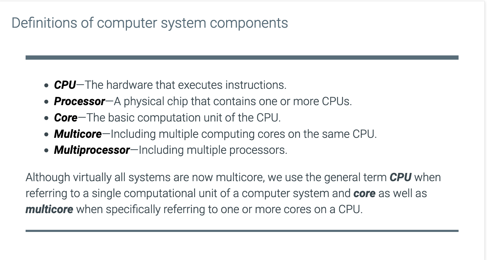
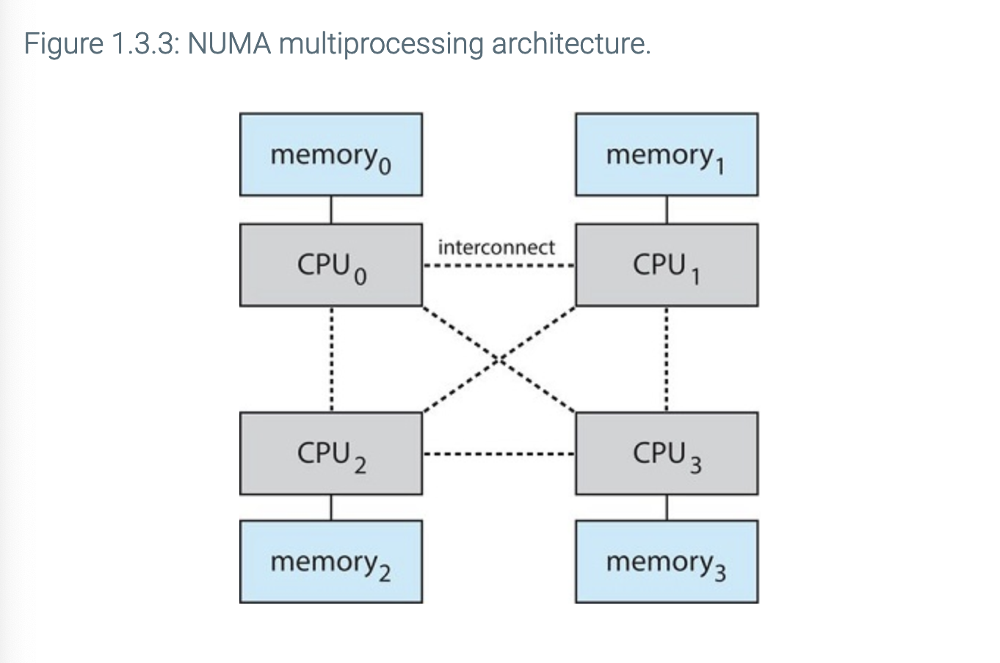
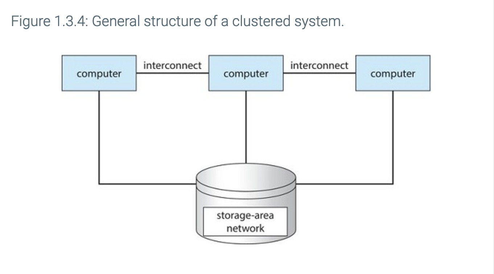

# Chapter 1: Introduction

## Objectives of this chapter
- How is a computer system organized?
- What is the point of interrupts?
- What components is a modern multiprocessor computer system composed of?
- What is user mode?
- What is kernel mode?
- Can you illustrate the transition between user mode and kernel mode?
- How are operating systems used in different computing environments?
- Can you name examples of free and open source operating systems?

## Chapter 1.1: What operating systems do

What are the 4 components of a computer system?

- Hardware

- Application programs

- Operating system

- A user

What is a computer's hardware made out of?

- One or more CPUs

- I/O devices

- Memory

What is an Operating System (OS) composed of?

- A kernel that is loaded when the computer turns on

- Kernel functions loaded at runtime

- Any system programs related to the kernel

What is middleware?

- These are application programs for developers that provide additional services

The book's definition of what an OS is

    
 An OS is composed of:

        <ul>
            <li>A kernel that is loaded at boot time (when the computer turns on)</li>
            <li>Device drivers and kernel functions that are loaded at runtime</li>
            <li>System programs related to the kernel</li>
        </ul>

## Chapter 1.2: Computer system organization

    
What is a computer's system composed of?

    <ul>
        <li>One or many CPUs</li>
        <li>One or more devices connected to the computer</li>
        <li>A device controller for each device connected to the computer</li>
        <li>A device driver for each device controller</li>
        <li>A system bus that acts as the main communications path between devices and memory</li>
    </ul>

### Interrupts

#### Overview

What is an interrupt?

A signal sent to the CPU telling it to stop what its doing and handle the device that triggered the interrupt

As you can see in the picture above, whenever the I/O device is ***in the process of transferring data***, nothing happens to the CPU.

It is only ***after the I/O device is done transferring data*** that the interrupt signal is sent to the CPU, stopping it from whatever it was doing, and forcing it to handle it.

The CPU only returns back to its previous process ***after*** handling the interrupt

#### Implementation

What is an interrupt vector table?

A data structure that associates interrupt handlers with interrupt requests

What must an interrupt vector table keep track of?

It must keep track of the state before the CPU changed its focus to handling the interrupt

How is an interrupt mechanism implemented?

    
- An ***interrupt request line***

    
- An ***interrupt handler***

What is an interrupt request line (IRQ)?

It's an electrical line or channel that signals the CPU about an interrupt

What is an interrupt handler?

A block of code responsible for handling an interrupt and giving the wheel back to the CPU

What is the life cycle of an interrupt?

1. A device ***raises*** an interrupt

2. The CPU ***catches*** the interrupt

3. The CPU ***dispatches*** the interrupt to the interrupt handler

4. The interrupt handler ***clears*** the device by servicing the device

What is a non-maskable interrupt (NMI)?

An interrupt that the system cannot ignore

What is a maskable interrupt 

An interrupt that the system can ignore

What is interrupt chaining?

Interrupt chaining is an implementation of the interrupt vector table in which each interrupt request line is associated with a linked list of interrupt handlers

What problem does interrupt chaining try to solve?

The problem of having more devices than available interrupt handlers

### Storage structure

    
What is a bootstrap program?

    
A program that loads the Operating System when the computer is turned on. This is the first program to run on a computer

    
What is electrically erasable programmable read-only memory (EEPROM) used for?

    
It's used for holding the bootstrap program

    
Why can't we store the bootstrap program in RAM?

    
Cause RAM is volatile, so if the computer loses power, everything in RAM is gone

    
Why do we use EEPROM to store the bootstrap program?

    
Because EEPROM is rarely written to, and it is non-volatile (this means that anything store in EEPROM survives a reboot/loss of power)

### I/O Structure

    
What is direct access memory (DMA)?

    
It's a feature of modern computers that allows a device to access a computer's main memory and transfer data independently of the CPU

    
Why does DMA exist?

    
DMA exists because it lessens the workload on the CPU

### Section Review Questions

    
What do we call the signal used by device controllers to inform device drivers that it has completed an I/O operation

    
An interrupt

    
Describe what a maskable interrupt is

    
A maskable interrupt is an interrupt that can be temporarily disabled

    
Which of these has the largest capacity: Registers, hard-disk drives, or non-volatile memory

    
Non-volatile memory

## 1.3 Computer System Architecture

### Single-processor systems

    
What is a single-processor system

    
A computer system with a single CPU that contains a single processing core

    
What does a processing core do

    
The core executes instructions and contains registers for locally storing data

### Multiprocessor systems

    
What is a multiprocessor system

    
A computer system (can also be a phone) that has two or more CPUs each containing a single processing core

    
What is the advantage of multiprocessor systems over single-processor systems?

    
Multiprocessor systems can do more work in less time

    
What is symmetric multiprocessing (SMP)?

    
It's a copmuter architecture of multiprocessor systems in which two or more identical processors are connected to a single shared memory

    
What is the benefit of symmetric multiprocessing (SMP)?

    
Many processes can run simultaneously

    
What is a multicore system?

    
A processor with more than one core

    
What is the name of the physical chip that contains one or more CPUs

    
The processor

    
Does multicore also mean multiple CPUs? (Yes or no)

    
No. Multicore means multiple copmuting cores on the same CPU

    
Name one (or more) advantage(s) of adding additional CPUs to a multiprocessor system

    
Adding more CPUs increases computing power

    
Name one (or more) disadvantage(s) of adding more CPUs to a multiprocessor system

    
Adding more CPUs creates a bottleneck in the system bus

    
Why does adding more CPUs to a multiprocessor create a bottleneck in the system bus

    
The CPUs in the multiprocessor will keep trying to send data thru the system bus, but the system bus can only take so much. At one point, the system bus will not allow CPUs to send more data, and it will be like a queue where only one CPU can send data at a time

    
What is a non-uniform memory access (NUMA) architecture?

    
A NUMA is a type of multiprocessor architecture where every CPU has its own local memory that is accessed via a fast local bus

    
What is a shared system interconnect?

    
It is like a cord that connects all CPUs in a NUMA architecture so that they (the CPUs) share the same physical address

    
Name on drawback/disadvantage of the NUMA architecture

    
If CPU1 needs to access the local memory of CPU3, it'll take longer to do so. Therefore, the drawback is latency

    
What is a blade server?

    

    
What is a clustered system

    
A system that combines two or more computer systems together

    
What do cluster systems provide as opposed to any other system?

    
High-availability service. Service that will continue on even if one computer system dies in the clustered system

    
What is graceful degradation?

    
It is the ability of a clustered system to continue providing services even if parts of the system are dysfunctional or inoperative

    
What is a fault tolerant system?

    
A clustered system that can continue operations even after failure of any single component

    
What is asymmetric clustering?

    
A clustered system where one machine is idle until an active server fails, at which point it takes the responsibilities of the server that failed

    
What is symmetric clustering?

    
A clustered system where every system is running and keeping tabs on each other to make sure they don't pass out at the club (analogy to help me remember)

    
What is parallelization?

    
A process that divides a program up into separate components, and gives each component so they can run it in parallel

