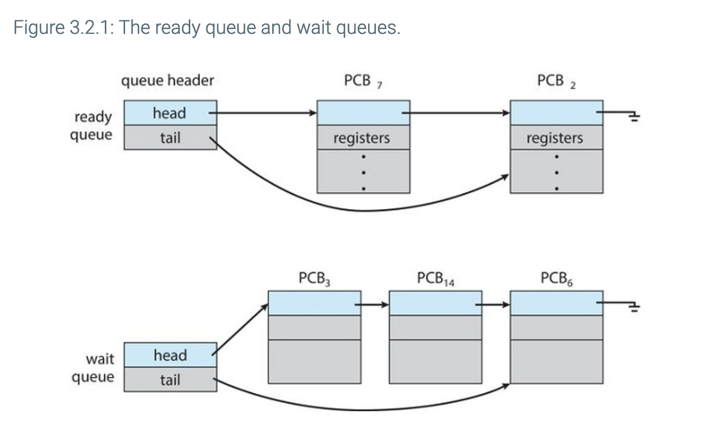
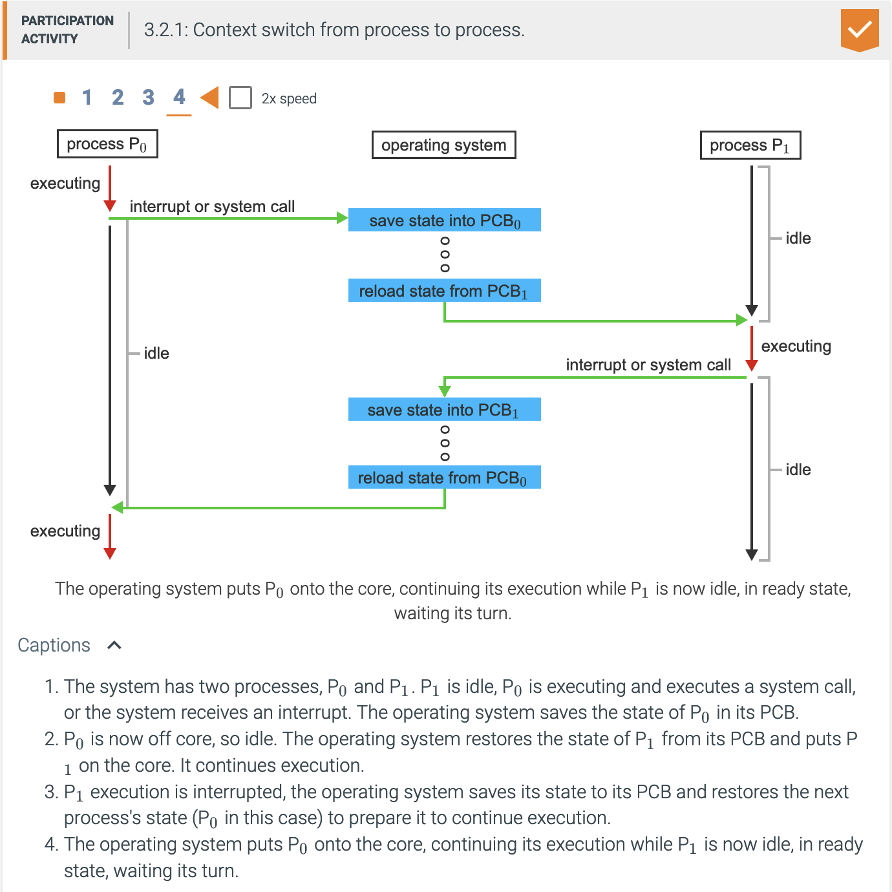

# Chapter 3: Processes

## Objectives of this chapter

- What are the different component of a process?
- How are the different components of a process represented?
- How are the different component of a process scheduled in an operating system?
- How are processes created?
- How are processes terminated?
- What are the differences between shared memory and message passing in interprocess communication?
- How can a process use pipes and POSIX shared memory to perform interprocess communication?
- What is a client-server communication that uses sockets?
- What is a client-server communication using remote procedure calls?
- How does a kernel module interact with the Linux operating system?

## Chapter 3.1: Process concept

<details>
    <summary>What does the program counter tell us about the current activity of a process?</summary>
    <div>The program counter is used to represent the status of the currentactivity of a process</div>
</details>

<details>
    <summary>Describe the 4 sections of memory and what purpose they serve</summary>
    <ul>
        <li>Text: where executable code lives</li>
        <li>Data: where global variables live</li>
        <li>Heap: memory allocated dynamically during runtime</li>
        <li>Stack: temp data storage for function calling (function parameters, return addresses, and local variables live here)</li>
    </ul>
</details>

<details>
    <summary>What is the order of the layout of all 4 sections of memory?</summary>
    <ol>
        <li>Stack</li>
        <li>Heap</li>
        <li>Data</li>
        <li>Text</li>
    </ol>
</details>


<details>
    <summary>Which two sections of memory can shrink and grow during program execution?</summary>
    <div>Stack and heap</div>
</details>

<details>
    <summary>The stack and heap "grow" towards one another, what must the operating system ensure?</summary>
    <div>The operating system must ensure that they don't overlap each other</div>
</details>

<details>
    <summary>When does a program become a process?</summary>
    <div>When the program's executable file is loaded into memory</div>
</details>

<details>
    <summary>What are the 5 states of a process and what they represent?</summary>
    <ul>
        <li>New: the process is being created</li>
        <li>Running: Instructions are being executed</li>
        <li>Waiting: Process is waiting for some event to occur</li>
        <li>Ready: Process is waiting to be given to a processor</li>
        <li>Terminated process is done executing</li>
    </ul>
</details>


<details>
    <summary>How many processes can be running on any processor core at any instant?</summary>
    <div>Only one!</div>
</details>


<details>
    <summary>What is a process control block (PCB)?</summary>
    <div>It is the way each process is represented in an operating system</div>
</details>

<details>
    <summary>What 7 things are included/contained in a PCB?</summary>
    <ul>
        <li>Process state: Self-explanatory</li>
        <li>Program counter: Indicates where the next instruction for this process is</li>
        <li>CPU registers</li>
        <li>CPU-scheduling information</li>
        <li>Memory-management information</li>
        <li>Accounting information</li>
        <li>I/O status information</li>
    </ul>
</details>


## Chapter 3.2: Process Scheduling

<details>
    <summary>What is the point/objective of multiprogramming?</summary>
    <div>To maximize CPU utliziation and have some process running at all times</div>
</details>

<details>
    <summary>What is the point/objective of time sharing?</summary>
    <div>To make the CPU switch among processess so frequently that you can interact with each of them while they're running</div>
</details>

<details>
    <summary>What does the process scheduler do?</summary>
    <div>It selects an available process for program execution by a core</div>
</details>

<details>
    <summary>What does the degree of multiprogramming measure?</summary>
    <div>The number of processes currently in memory</div>
</details>


<details>
    <summary>What is an I/O bound process?</summary>
    <div>A process that spends most of its time doing I/O stuff</div>
</details>

<details>
    <summary>What is a CPU bound process?</summary>
    <div>A process that spends most of its time doing computations</div>
</details>

<details>
    <summary>Where do processes go when they enter the system?</summary>
    <div>The ready queue!</div>
</details>




<details>
    <summary>What is the point/objective of the CPU scheduler?</summary>
    <div>It is to select a process in the ready queue and assign it to a CPU core</div>
</details>

<details>
    <summary>What is swapping?</summary>
    <div>It is a CPU scheduling scheme where a process is swapped out of from memory to disk, then later swapped in exactly where it left off</div>
</details>

<details>
    <summary>What is the advantage of swapping?</summary>
    <div>Lower degree of multiprogramming</div>
</details>




## Chapter 3.3: Operations on processes


<details>
    <summary>When a process births a child, what 2 things can happen to the parent?</summary>
    <ul>
        <li>Parent and child have a beautiful time executing at the same time</li>
        <li>Parent sits in his couch, waiting for his kids to be done playing ball outside</li>
    </ul>
</details>

<details>
    <summary>When a process births a child, what are the 2 possible characteristics of that child?</summary>
    <ul>
        <li>The child is an exact copy of his mom, so it has the same program and data as mom</li>
        <li>The child has an entirely new program loaded into it</li>
    </ul>
</details>

<details>
    <summary>Creating a new process uses the <code>fork()</code> system call, what happens after that?</summary>
    <ol>
        <li>The address space of parent gets copied to child</li>
        <li>Both processes continue execution after <code>fork()</code></li>
    </ol>
</details>

<details>
    <summary>What does the <code>exec()</code> system call do?</summary>
    <div>It loads a binary file into memory</div>
</details>


<details>
    <summary>When forking a parent, what will its child's PID be? What about the parent's PID?</summary>
    <div>The child's PID will be == 0; The parent's will be > 0</div>
</details>


<details>
    <summary>What is the order of a C program that forks a parent?</summary>
    ```c
    pid_t pid;
    pid = fork();

    if (pid == 0) {
        // This is the child
    }

    if (pid > 0) {
        wait(NULL);
        // This is the parent
    }

    if (pid < 0) {
        // Some error occurred
    }
    ```
</details>

<details>
    <summary>What does the `exit()` system call do?</summary>
    <div>It asks the operating system to delete the process that used it</div>
</details>

<details>
    <summary>What does cascading termination mean?</summary>
    <div>It means that if the parent dies, all of its kids must die with it (so sad)</div>
</details>

<details>
    <summary>What is a zombie process?</summary>
    <div>A child who has passed away, and whose parent did not call `wait()`</div>
</details>

<details>
    <summary>What is an orphan process?</summary>
    <div>A child whose parent passed away before the child terminated (so sad)</div>
</details>

<details>
    <summary>What does UNIX/Linux do about orphans?</summary>
    <div>They make `systemd` the new parnet (so happy)</div>
</details>


## Chapter 3.4: Interprocess communication

<details>
    <summary>What is an independent process?</summary>
    <div>This is a characteristic of processes that execute concurrently. This is a process that does not share data with any other processes executing in the system</div>
</details>

<details>
    <summary>What is cooperating process?</summary>
    <div>This is a characteristic of processes that execute concurrently. This is a process who affects, or is affected by, other processes executing in the system</div>
</details>

<details>
    <summary>What is the point of cooperating processes?</summary>
    <div>They allow you to:</div>
    <ul>
        <li>Speed up computational processes by divide and conquering!</li>
        <li>Share information between different processes</li>
        <li>Divide functions into separate processes or threads to increase modularioty</li>
    </ul>
</details>

<details>
    <summary>What is the point of an interprocess communication (IPC) mechanism?</summary>
    <div>To allow cooperating process to exchange data</div>
</details>

<details>
    <summary>What is the main idea behind the shared memory model of IPC?</summary>
    <div>The main idea is that cooperating processes share a section of memory</div>
</details>

<details>
    <summary>What is the main idea behind the message passing model of IPC?</summary>
    <div>The main idea is that each cooperating process communicates with the process that it's cooperatin with. In other words, it's like a tunnel exists between only those processes that need to talk to one another/</div>
</details>


<details>
    <summary>Why is shared memory typically faster than message-passing?</summary>
    <div>Because message passing is usually implemented thru system calls</div>
</details>


